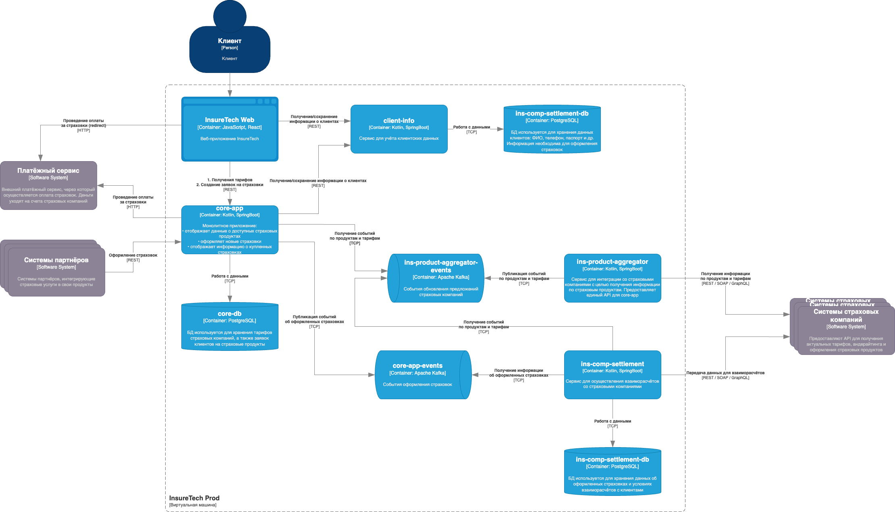

# Переход на Event-Driven архитектуру

## Проблемы и риски

| Проблема | Риск | Предложение |
|--|--|--|
| Синхронная коммуникация между `core-app`/`ins-comp-settlement` и `ins-product-aggregator`. Уже сейчас команда сталкивается с ошибками взаимодействия между этими сервисами. Они связаны с задержками ответов или ошибками при взаимодействии с API страховых компаний. | - В следствие ошибок взаимодействия в сервисах `core-app`/`ins-comp-settlement` будут неактуальные данные - С добавлением новых интеграций синхронная обработка запроса становится всё тяжелее, что ещё сильнее сказывается на её стабильности. - Создаёт периодическую нагрузку на системы (в зависимости от объёма данных) - Дублирование запросов - получение одинаковых данных из разных сервисов. | Перевод на асинхронную коммуникацию, основанную на событиях, поможет решить проблему. Каждое изменение в продуктах страховых компаний публикуется в виде события, которые `core-app`/`ins-comp-settlement` обрабатывают асинхронно.   Это снизит связанность между сервисами и сделает обработку данных более "плавной" и гранулярной.  Для гарантированной отправки в сервисе требуется реализовать паттерн Transactional Outbox. |
| Сервис `core-app` осуществляет запрос к `ins-product-aggregator` раз в 15 минут, а `ins-comp-settlement` — раз в сутки (ночью), при формировании реестра оформленных страховок. | Разные сценарии и расписания актуализации одних и тех же данных в разных сервисах. Это может привести к тому, что разные сервисы в одно и то же время запросят одинаковые данные, что приведёт к дублированию запросов к внешним сервисам. | Сервисы `core-app` и `ins-comp-settlement` работают с локальными данными, а настройки актуализации данных из внешних сервисов определяются в `ins-product-aggregator`. |
| Синхронные запросы от `ins-product-aggregator` к страховым компаниям внутри синхронного запроса от `core-app` и `ins-comp-settlement`. При каждом запросе сервис `ins-product-aggregator` выполняет вложенные запросы к страховым компаниям, агрегирует данные и возвращает значения в рамках того же синхронного запроса. ] | - Ошибки в одной из интеграций с любой из страховых компаний приведёт к ошибке обработки всего запроса; - Добавление новых интеграций делает синхронную обработку ещё тяжелее, что скажется на стабильности её работы - Каждая новая интеграция требует внесение изменения в обработку запроса, что может повлиять на уже существующие интеграции. | Разнести интеграции со страховыми компаниями на разные процессы. Каждая интеграция формирует свой поток событий с уведомлениями об изменениях продуктов. Тем более, что в сервисах `core-app` и `ins-comp-settlement` уже хранятся локальные реплики данных о продуктах и тарифах. Это снизит связанность между интеграциями и позволит легче добавлять новые.   При использовании паттерна Transactional Outbox полученные данные от страховых сначала записываются в таблицу событий, а отправляются фоновым процессом. |
| Синхронный запрос раз в сутки от сервиса `ins-comp-settlement` в `core-app` по REST API для получения всех оформленных за день страховок. | - В случае сбоев обработки в сервисе будут неактуальные данные, а так же возможна потеря данных - При возрастании объёма данных сложно масштабировать процесс получения оформленных страховок. | Реализовать в `core-app` публикацию событий при оформлении страховок (с использованием паттерна Transactional log tailing), а в сервисе `ins-comp-settlement` - обработку событий и обновление локальных данных.  Переход на асинхронную Event-Driven коммуникацию позволит гибко масштабировать обработчики событий в зависимости от объёма данных. А так же снизит вероятность потери данных. |
|  |  |

## Использование паттернов

### Transactional outbox

Паттерн стоит использовать в сервисе `ins-product-aggregator` при получении актуальных данных по страховым продуктам. При получении данных от страховой сервис записывает их в outbox-таблицу, а отправка в брокер сообщений выполняется фоновым заданием.

### Transactional log tailing

В `core-app` выгоднее использовать паттерн Transactional log tailing для отправки событий. Это позволит не добавлять в бизнес-логику оформления страховки дополнительных процессов, а на уровне базы данных формировать события. Тем более, что `core-app` - монолитное приложение с потенциальными проблемами масштабирования.

## Диаграмма контейнеров To-Be

[InsureTech_C4_сontainer-diagram_to-be](./InsureTech_C4_сontainer-diagram_to-be.drawio)

