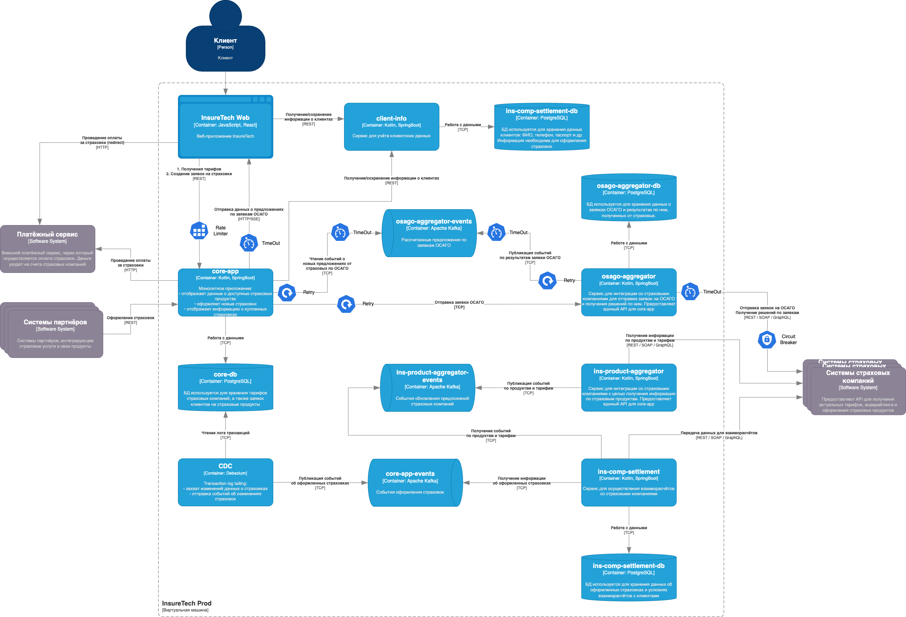

# Проектирование продажи ОСАГО

## Сервис `osago-aggregator`

Сервис реализует интеграцию со страховыми компаниями: отправляет запрос на расчёт заявки в API страховых, проверяет статус обработки запроса, отправляет событие о полученных предложениях по заявкам ОСАГО.

> Важно: при обработке заявки сервис не дожидается ответов от всех страховых, а отправляет событие по предложениям от страховых как только оно получено.

## Хранилище данных

`osago-aggregator-db` - хранилище данных по заявкам ОСАГО, а так же полученных предложениях от них от страховых компаний. В базу данных записываются отправленные запросы в страховые и статус их обработки. Позволяет сохранять контекст заявки, необходимый для обработки.

## API `osago-aggregator` и интеграция с `core-app` 

API сервиса `osago-aggregator` предоставляет команду на расчёт заявки на ОСАГО, получая которую сервис запускает запросы на расчёт в сервисы страховых.

Результаты расчётов и предложения от страховых предоставляются сервису `core-app` асинхронно с использованием брокера сообщений. Как только от страховой компании получены результаты расчёта с предложениями - публикуется событие в брокер сообщений с данными.

## API в `core-app` и интеграция с веб-приложением

Между веб-приложением и `core-app` необходимо реализовать SSE-взаимодействие. После создания заявки на ОСАГО и отправки её на расчёт `core-app` отправляет команду `osago-aggregator` и получает результат асинхронно через очереди. Результат отправляется в веб-приложение с использованием SSE-подключения.

Client Pull в данной ситуации будет не уместен, поскольку предполагается 2,5 тысячи одновременных пользователей и в таком сценарии это приведёт к большому количеству запросов.

WebSocket - избыточен в данной ситуации, поскольку требуется только отправлять данные с сервера на клиент, а WebSocket добавит сложности в реализации.

## Паттерны отказоустойчивости

### Rate Limiting

Поскольку предполагается пик нагрузки до 2500 одновременных пользователей нужно регулировать объём запросов на расчёт ОСАГО, поступающих от них. Каждый расчёт заявки сопровождается множеством синхронных и асинхронных коммуникаций внутренних и внешних сервисов. Для защиты системы от перегрузки необходимо ограничить количество запросов, отправляемых клиентом приложения.

### Circuit Breaker

Для всех интеграций с API страховых компаний используется Circuit Breaker и отключает интеграцию при проблемах в интеграции.

### Retry

Паттерн Retry необходимо реализовать для интеграций:

- синхронная отправка запроса `core-app` в `osago-aggregator` - позволит решить проблему кратковременной недоступности сервиса и ошибок сети;
- публикация и чтение событий из брокера сообщений;
- запросы во внешние сервисы страховых - совместно с паттерном timeout повысит шансы получить ответ от сервиса в случае сбоев связи и кратковременной недоступности сервиса.

### Timeout

По требованию бизнеса максимальное время ожидания решения от страховой компании - 60 секунд. А значит стоит учесть это при разработке решения.
Для SSE-подключения стоит установить тайм-аут сессии, а в запросе серверу передавать время запроса. Это время нужно использовать далее во всез запросах, чтобы "отсчитывать" общий тайм-аут обработки - 60 секунд.

`core-app` - использует время начала запроса при обработке результатов предложений от страховых компаний и отсекает события, которые вышли за рамки тайм-аута (поскольку клиент их уже не ждёт)
`osago-aggregator` - использует время начала запроса при получении данных от страховых компаний и не передаёт события дальше, если время обработки вышло за рамки тайм-аута.

Такой подход позволит избежать лишней работы сервисов по запросам с истёкшим тайм-аутом, результат которых клиент уже не ждёт.

Кроме таймаута обработки заявки каждый сервис должен использовать таймаут запросов. Это позволит избежать зависания запросов и их бесконечную обработку.

## Сложности 

Некоторые сервисы могут быть развёрнуты в нескольких экземплярах, поэтому стоит оценить как это повлияет на обработку запросов.

### `osago-aggregator` и `core-app`

Для интеграции не важно какой экземпляр `osago-aggregator` получит запрос на расчёт. Промежуточные результаты сохраняются в БД, и обработать результаты сможет любой из инстансов сервиса.

### `core-app` и веб-приложение

При полуении событий результатов обработки заявки на ОСАГО любое из экземпляров приложения `core-app` может обработать его. Но для взаимодействия с UI используется SSE-подключения и серверу нужно отправить данные на клиента.

В данной ситуации результат обработки нужно записать во внешнее хранилище, т.е. базу данных приложения. Для отправки данных сервер получает их из базы и отправляет на сторону клиента через SSE-подключение.

## Архитектурная диаграмма

[InsureTech_C4_сontainer-diagram_to-be](./InsureTech_C4_сontainer-diagram_to-be.drawio)

